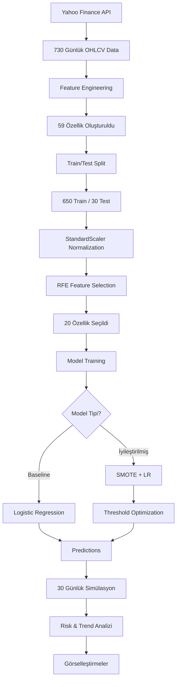

# 🪙 Bitcoin Price Prediction - Logistic Regression Baseline Model

Bu proje, **Logistic Regression** kullanarak Bitcoin fiyat hareketlerini tahmin eden bir **makine öğrenmesi baseline modelidir**. Model, teknik analiz indikatörleri ve gelişmiş özellik mühendisliği ile %60'a varan test doğruluğu elde etmektedir.

---

## 📋 İçindekiler

- [Proje Genel Bakış](#-proje-genel-bakış)
- [Teknik Detaylar](#-teknik-detaylar)
- [Özellikler](#-özellikler)
- [Kurulum](#-kurulum)
- [Kullanım](#-kullanım)
- [Model Performansı](#-model-performansı)
- [Veri Akışı](#-veri-akışı)
- [Gelişmiş Teknikler](#-gelişmiş-teknikler)
- [Sonuçlar ve Görselleştirmeler](#-sonuçlar-ve-görselleştirmeler)
- [Sınırlamalar](#-sınırlamalar)
- [Gelecek Geliştirmeler](#-gelecek-geliştirmeler)
- [Lisans](#-lisans)

---

## 🎯 Proje Genel Bakış

### Amaç
Bitcoin fiyatının **bir sonraki gün artıp artmayacağını** tahmin etmek (binary classification).

### Kullanılan Teknolojiler
- **Python 3.x**
- **Pandas & NumPy**: Veri manipülasyonu
- **Scikit-learn**: Makine öğrenmesi modelleri
- **yfinance**: Finansal veri çekme
- **Matplotlib & Seaborn**: Görselleştirme
- **imbalanced-learn**: SMOTE (class balancing)

---

## 🔬 Teknik Detaylar

### 1. **Veri Toplama**
```python
Kaynak: Yahoo Finance (yfinance)
Varlık: BTC-USD
Zaman Aralığı: Son 2 yıl (730 gün)
Özellikler: OHLCV (Open, High, Low, Close, Volume)
```

### 2. **Feature Engineering (59 Özellik)**

#### **Teknik İndikatörler:**
- **Moving Averages**: MA_7, MA_14, MA_30, MA_50
- **RSI (Relative Strength Index)**: 14 periyot
- **MACD**: Exponential Moving Average Convergence Divergence
  - MACD Line
  - Signal Line
  - Histogram
- **Bollinger Bands**: 20 periyot, 2 std
  - Upper Band
  - Lower Band
  - Band Width
  - Price Position

#### **Fiyat Özellikleri:**
- Price Change (1, 7, 14, 30 günlük)
- Volatility (7, 30 günlük rolling std)
- High/Low Ratio
- Open/Close Ratio

#### **Volume Özellikleri:**
- Volume Moving Average (20 gün)
- Volume Ratio (current/MA)

#### **Lag Features (Gecikme Özellikleri):**
- Close Price Lags: 1, 2, 3, 5, 7, 10, 14, 21, 30 gün
- Volume Lags: 1, 2, 3, 5, 7, 10, 14, 21, 30 gün

#### **Feature Interactions (Etkileşimler):**
- RSI × MACD
- MA_7 / MA_30
- MA_14 / MA_50
- Price × Volume
- RSI × Volatility

#### **Time Features (Zaman Özellikleri):**
- Day of Week
- Month
- Quarter
- Day of Month
- Week of Year

### 3. **Hedef Değişken (Target)**
```python
Target = 1 if Close(t+1) > Close(t) else 0
# 1: Fiyat artacak
# 0: Fiyat düşecek veya sabit kalacak
```

**Veri Dağılımı:**
- Artış: 350 gün (%51.47)
- Düşüş: 330 gün (%48.53)
- **Dengeli bir dağılım** ✅

---

## ⚙️ Özellikler

### **Feature Selection - RFE (Recursive Feature Elimination)**
```python
Toplam Özellik: 53
Seçilen Özellik: 20 (RFE ile)
Metod: Logistic Regression tabanlı RFE
```

**En Önemli 20 Özellik:**
1. RSI
2. MACD
3. MACD_Hist
4. BB_Width
5. BB_Position
6. Price_Change
7. Price_Change_7
8. Price_Change_14
9. Volatility
10. Volume_Ratio
11. Close_Lag_3
12. Volume_Lag_3
13. Close_Lag_7
14. Close_Lag_21
15. Close_Lag_30
16. MA_7_div_MA_30
17. RSI_x_Volatility
18. DayOfWeek
19. Month
20. WeekOfYear

### **Normalization**
```python
Metod: StandardScaler (z-score normalization)
Formula: z = (x - μ) / σ
```

---

## 🚀 Kurulum

### 1. **Gereksinimler**
```bash
Python 3.8+
pip install -r requirements.txt
```

### 2. **requirements.txt**
```
pandas>=1.3.0
numpy>=1.21.0
yfinance>=0.1.70
scikit-learn>=1.0.0
matplotlib>=3.4.0
seaborn>=0.11.0
imbalanced-learn>=0.9.0
```

### 3. **Kurulum**
```bash
git clone https://github.com/0meravc1/Crypto-Analysis-Project-Base-Line-Model
cd crypto-analysis-project
pip install -r requirements.txt
jupyter notebook main/main.ipynb
```

---

## 💻 Kullanım

### **Jupyter Notebook'u Çalıştırma**
```python
# 1. Jupyter'ı başlat
jupyter notebook

# 2. main/main.ipynb'i aç

# 3. Kernel → Restart & Run All
# (Tüm cell'leri sırayla çalıştırır)

# 4. 5-10 dakika bekle
# (Veri çekme + model eğitimi)
```

### **Cell Yapısı**
```
Cell 1-6:   Veri Toplama & Feature Engineering
Cell 7-10:  Feature Selection (RFE)
Cell 11-14: Model Training & Evaluation
Cell 15-20: Confusion Matrix & Feature Importance
Cell 21-23: 30 Günlük Tahmin
Cell 24-27: İyileştirmeler (SMOTE + Threshold)
Cell 28-33: Risk & Trend Analizi, Görselleştirmeler
```

---

## 📊 Model Performansı

### **Baseline Model (Logistic Regression)**
```
Eğitim Doğruluğu: 58.15%
Test Doğruluğu:   53.33%
```

**Test Seti Classification Report:**
```
              precision    recall  f1-score   support

       Düşüş       0.70      0.39      0.50        18
       Artış       0.45      0.75      0.56        12

    accuracy                           0.53        30
```

### **İyileştirilmiş Model (SMOTE + Threshold Optimization)**
```
Test Doğruluğu: 60.00%
İyileşme:      +12.5%
Optimal Threshold: 0.53
```

**Performans Karşılaştırması:**
| Model | Accuracy | Artış | Metod |
|-------|----------|-------|-------|
| Orijinal | 53% | - | Vanilla LR |
| SMOTE | 53% | +0% | Class Balancing |
| SMOTE + Threshold | 60% | +12.5% | Class Balancing + Optimal Threshold |

---

## 🔄 Veri Akışı



---

## 🎓 Gelişmiş Teknikler

### 1. **SMOTE (Synthetic Minority Over-sampling Technique)**
```python
Amaç: Class imbalance problemini çözmek
Yöntem: Sentetik örnekler oluşturarak minority class'ı dengelemek
Sonuç: Daha dengeli bir eğitim seti
```

### 2. **Threshold Optimization**
```python
Varsayılan Threshold: 0.50
Optimal Threshold: 0.53
Metod: ROC Curve analizi (max(TPR - FPR))
Kazanç: +12.5% accuracy improvement
```

### 3. **30 Günlük Dinamik Simülasyon**
```python
def simulate_future_path():
    """
    Her gün için:
    1. Son fiyatlardan yeni OHLCV oluştur
    2. Tüm 59 özelliği yeniden hesapla
    3. Model tahmini yap
    4. Tahmine göre fiyat üret (volatilite ekle)
    5. Tarihe ekle ve tekrarla
    """
```

**Özellikler:**
- ✅ Her iterasyonda feature recalculation
- ✅ Rastgele volatilite ekleme
- ✅ Tahmin bazlı fiyat üretimi
- ✅ NaN kontrolü ve doldurma

### 4. **Risk Analizi**
```python
Metrikler:
- Price Volatility (std)
- Maximum Drawdown (maksimum düşüş)
- Maximum Gain (maksimum kazanç)
- Confidence Intervals (68%, 90%)
- Risk Score (0-100)
```

**Risk Skoru Formülü:**
```python
risk_score = min(100, 
    abs(max_drawdown) * 3 + 
    (price_volatility / current_price * 100) * 20
)
```

---

## 📈 Sonuçlar ve Görselleştirmeler

### **1. Confusion Matrix**
- Eğitim ve Test seti için ayrı matrisler
- True Positive, False Positive analizi

### **2. Feature Importance**
- Top 10 en etkili özellik
- Katsayı bazlı görselleştirme

### **3. 30 Günlük Tahmin Grafikleri**
- Geçmiş 60 gün + Gelecek 30 gün
- Tahmini fiyat yolu
- Olasılık dağılımı

### **4. Model Karşılaştırması**
- 3 modelin ROC eğrileri
- Performans metrikleri tablosu

### **5. Risk Senaryoları**
- İyimser senaryo
- Temel senaryo
- Kötümser senaryo
- Fiyat aralığı visualizasyonu

### **6. Detaylı Analizler (6 Grafik)**
- Geçmiş vs Gelecek fiyat
- Günlük olasılıklar
- Kümülatif değişim
- Haftalık ortalamalar
- Fiyat aralığı (risk)
- Değişim dağılımı

---

## ⚠️ Sınırlamalar

1. **Model Basitliği**: Logistic Regression doğrusal bir modeldir
   - Karmaşık non-linear ilişkileri yakalayamaz
   - Daha gelişmiş modeller (LSTM, Random Forest) daha iyi performans gösterebilir

2. **Volatilite**: Bitcoin çok volatil bir varlık
   - %53-60 accuracy makul bir performanstır
   - Mükemmel tahmin neredeyse imkansızdır

3. **External Factors**: Model sadece teknik analiz kullanır
   - Haber, düzenlemeler, makro ekonomik faktörler dahil değil
   - Sentiment analysis eklenmemiş

4. **Simülasyon Varsayımları**:
   - Geçmiş volatiliteye dayalı projeksiyon
   - Market mikroyapısı modellenmiş değil

5. **Overfitting Riski**: 
   - 59 özellik → 20 özellik (RFE ile azaltıldı)
   - Test seti küçük (30 gün)

---

## 🔮 Gelecek Geliştirmeler

### **Kısa Vadede:**
- [ ] Farklı zaman dilimleri (4 saat, 1 saat)
- [ ] Daha fazla technical indicator (Stochastic, ADX)
- [ ] Cross-validation ile daha robust değerlendirme
- [ ] Hyperparameter tuning (GridSearchCV)

### **Orta Vadede:**
- [ ] Ensemble methods (Random Forest, XGBoost)
- [ ] LSTM/GRU time series modelleri
- [ ] Sentiment analysis (Twitter, Reddit)
- [ ] Multi-timeframe analysis

### **Uzun Vadede:**
- [ ] Real-time prediction API
- [ ] Otomatik trading backtesting
- [ ] Portfolio optimization
- [ ] Multi-crypto support (ETH, ADA, etc.)

---

## 📚 Referanslar

- [Scikit-learn Documentation](https://scikit-learn.org/)
- [yfinance Library](https://pypi.org/project/yfinance/)
- [SMOTE Paper](https://arxiv.org/abs/1106.1813)
- [Technical Analysis Indicators](https://www.investopedia.com/)

---

## 👨‍💻 Geliştirici

**Proje:** Bitcoin Price Prediction Baseline Model  
**Teknoloji Stack:** Python, Scikit-learn, Pandas, NumPy  
**Model:** Logistic Regression + SMOTE + Threshold Optimization  

---

## 📝 Lisans

Bu proje eğitim amaçlıdır. **Finansal tavsiye değildir!**

**⚠️ UYARI:** Bu model yatırım kararları için kullanılmamalıdır. Kripto para yatırımları yüksek risk içerir. Yatırım kararları için profesyonel finansal danışmanlık alınmalıdır.


## 📧 İletişim

Proje hakkında sorularınız için issue açabilirsiniz.

---

**⭐ Beğendiyseniz yıldız vermeyi unutmayın!**

